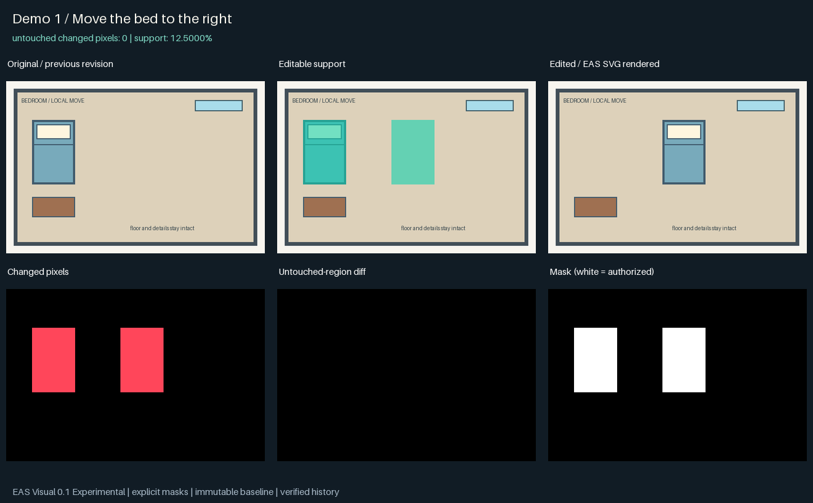
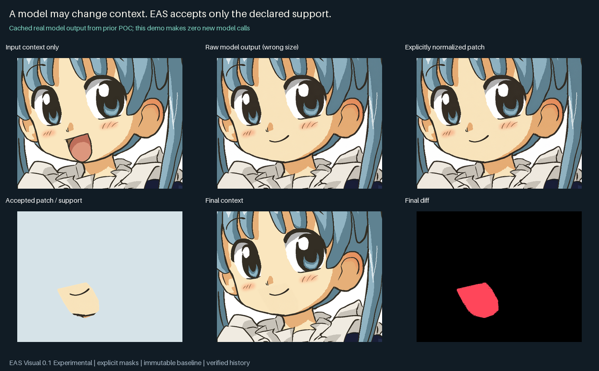
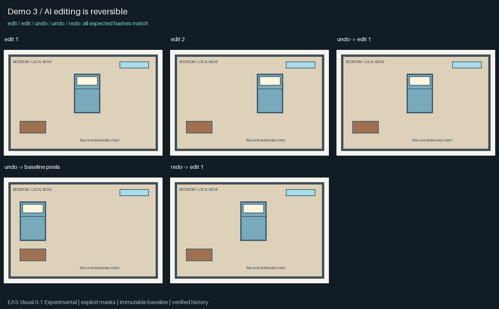

# EAS Visual

**Give your agent editable vision.**

EAS Visual 0.1 Experimental is a local, reversible visual editing tool for Agents.
It preserves a pixel-faithful baseline, promotes only the object you want to edit,
and verifies that everything outside the declared edit support stays unchanged.

**Image → Editable Scene → Agent Edit → Verified Result**



## Why

A generative image editor can change surrounding details even when the prompt asks it not to.
EAS Visual puts an explicit boundary around what the model may contribute:

```text
Immutable baseline
  → explicit object mask + editable support
  → local model patch / structural transform
  → strict masked composite
  → EAS SVG render + pixel validation
  → reversible revision
```

The image model supplies a local candidate. EAS Visual preserves the original,
records provenance, discards unauthorized context changes and supports undo.
The model can be replaced without changing the project/history format.

## Quick start

Requires **Python 3.12+** and **Inkscape**. The release was developed with Python 3.12
and Inkscape 1.4.2; checks fail closed if a renderer cannot reproduce the expected pixels.
On Ubuntu: `sudo apt-get install inkscape`. On Windows install Inkscape and use its
`bin/inkscape.com`; the normal install location is detected automatically.
Otherwise set `EAS_VISUAL_INKSCAPE` to the executable's absolute path.

```sh
git clone https://github.com/FelixVollerei/eas-hmi.git
cd eas-hmi
python -m venv .venv
# Linux/macOS: source .venv/bin/activate
# Windows PowerShell: .\.venv\Scripts\Activate.ps1
python -m pip install -e '.[dev,mcp]'
python scripts/demo_visual.py --output build/my-demo
```

Use a fresh venv. The Python distribution is now `eas-visual`; it includes the original
`eas_hmi` package and retains `eas-hmi`. Do not install the older `eas-hmi` distribution
alongside it. The repository keeps its existing GitHub URL and history.

For a quick CLI edit using the bundled original room artwork:

```sh
eas-visual init examples/visual/assets/room-input.png -o room.eas
eas-visual promote room.eas --label bed --bbox '[48,72,128,192]'
eas-visual move room.eas --object bed --dx 164 --dy 0 --donor '[350,160,390,200]'
eas-visual diff room.eas --json
eas-visual render room.eas -o result.png
eas-visual undo room.eas
eas-visual redo room.eas
eas-visual replay room.eas
```

Outputs must be new paths. `--bbox` uses exclusive right/bottom edges. JSON is the default
stdout format; `--json` is an explicit alias, not a switch from an undocumented text mode.
An operation returns `ok`, its revision, output hash and validation. Failed operations return
structured error codes and do not advance the scene. See [CLI / Agent contract](docs/AGENT-INTEGRATION.md).

## What works in v0.1

- Immutable original input and pixel-faithful baseline after explicit color reduction.
- Lazy semantic promotion with a bbox, polygon or binary mask from a person or Agent.
- Integer object move, preserving its pixels; donor or bounded external background repair.
- Constrained local generative patch exchange, with explicit dimension normalization.
- Actual EAS SVG raster validation: untouched MAE, changed pixels and maximum error.
- Undo, redo, reset, checkout and replay of persisted immutable history.
- Python API, JSON CLI and six-tool stdio MCP interface.
- Three reproducible demos and an inspectable [example project](examples/visual).

Baseline geometry is pure vector paths representing quantized pixels. It is a faithful visual
base, **not a claim of elegant, compact or semantically complete SVG**. Edits append local SVG
layers over it. Pixel exactness is checked at original resolution; resizing the SVG in another
renderer can produce different pixels.

## A model may change context. The scene need not.



The bundled smile demo reuses a **real cached model result from the previous POC**.
It makes no fresh model call and needs no API key. The model returned the wrong dimensions
and changed about **98.84%** of context pixels outside the mouth mask. After explicit patch
normalization and strict composition, the final scene has **0 changed pixels outside the
predeclared support** (mouth plus a 3 px blending margin, 0.3685% of the canvas).

The smile is visible; slight skin/seam differences remain. The mask was Agent-assisted.
This validates containment, not arbitrary instruction following or automatic segmentation.
Artwork: **Kasuga, Wikipe-tan, CC BY-SA 3.0**; the images above are adapted crops/composites.
[Source and derivative license](THIRD_PARTY.md).

For your own model, prepare a local request:

```sh
eas-visual prepare scene.eas --object mouth --instruction 'Make her smile gently.' --margin 3
# Give only the returned context_file and mask_file to your host image model.
# Save the returned patch and its actual metadata (provider required; unknown model/seed = null).
eas-visual edit scene.eas --object mouth --provider external-patch --request REQUEST_ID --patch returned.png --metadata provider.json
```

A size mismatch is refused unless you explicitly add `--normalize`. There is no silent mask
expansion or full-image provider fallback. `external-patch` is a file-exchange adapter for real
models called by the host; EAS does not make a hidden API call. `--provider mock` deterministically
paints blue for pipeline tests and does not understand natural-language instructions.

## Reversible by design



Every successful promotion/edit keeps its provenance, support mask, patch and verified result.
Undo/redo change the current revision pointer. New edits after undo preserve older branches for
`checkout EDIT_ID`. `reset` returns to the baseline; `replay` re-renders saved scenes without calling
any model. The immutable original is never an export target.

## Agent access

```sh
python -m pip install -e '.[mcp]'
eas-visual-mcp
```

The stdio server exposes `inspect_visual`, `create_visual_project`, `promote_object`,
`edit_visual`, `render_visual` and `undo_visual`. Set `EAS_VISUAL_ROOTS` to the workspace paths
it may access. Codex, DeepSeek Harness and other clients can share this tool layer; their SDKs
are not Core dependencies. A real MCP session is covered by tests; individual host integrations
are not yet certified. [Configuration and provider workflow](docs/AGENT-INTEGRATION.md).

## Experimental / known limitations

- Manual or Agent-assisted localization is supported. Automatic segmentation is not included.
- Donor repair handles simple repeated backgrounds; hidden content is estimated. Generative
  repair uses the same external patch boundary and can still have poor seams.
- `repair=none` is an explicit duplicate-placement diagnostic and warns that source pixels remain.
- Move can cover residual content. Overlap with another promoted object is refused; general
  multi-object ownership/occlusion is unsolved. Swap/scale/rotate are not in v0.1.
- Maximum 4M pixels; support limited to 25% of the scene; integer translation and 0–8 px margin.
  Provider context must be a crop smaller than the canvas. There is no outside-change override.
- Every operation audits all referenced history assets. Read cost and saved render caches grow
  with history; this release does not claim large-history performance is solved.
- Cross-renderer fidelity, complex continuous transforms and universal style preservation are
  not promised. A differing renderer causes validation failure, not a relaxed threshold.
- Previous EAS-HMI tests on this Windows machine recorded intermittent native access violations.
  That investigation remains open; v0.1 does not claim to fix native dependencies or machine issues.

No GUI, cloud service, new image model or Photoshop replacement is included.

## Validation and project internals

```sh
python -m pytest tests/test_visual.py -q
```

Tests cover immutable assets, adversarial context contamination, undo/redo/reopen/replay,
wrong-size/alpha patches, corrupt inactive history, invalid masks/targets, failed commits,
CLI JSON and a real MCP stdio session. See [release report](V0.1-RELEASE-REPORT.md) for actual
run results and release blockers, [format](docs/VISUAL-FORMAT.md) for integrity/transaction details,
and [demo evidence](docs/visual/demo-metrics.json) for measured values.

Code: `src/eas_visual/`. Existing EAS SVG core: `src/eas_hmi/` (unchanged by this release).
The original engineering-sidecar documentation is [archived here](docs/README-EAS-HMI.md).
[Roadmap](ROADMAP.md) · [Future scope](FUTURE.md) · [Changelog](CHANGELOG.md)

Code and original synthetic artwork: [MIT](LICENSE). Bundled character artwork and its derivatives:
[CC BY-SA 3.0, attribution and change notices](THIRD_PARTY.md).
