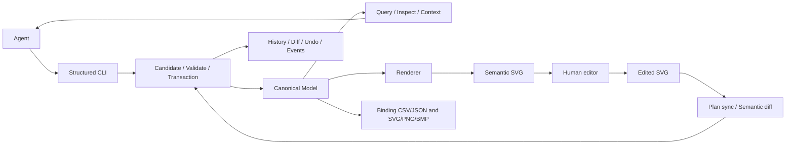

# EAS-HMI — Engineering Agent Sidecar for HMI

一个可运行的 Python 工程侧车实验：Agent 用结构化 CLI 查询和编辑工程，人用带语义 ID 的 SVG 编辑图形，
所有工程改动通过校验、事务、语义 diff 和历史记录进入 Canonical Model。

交付包含三页面合成数据中心：**90 台设备、390 点位、672 节点**，以及从查询到导出的完整 A–G Demo。
最终实测结果、环境和限制见 [最终验收报告](docs/stage-6-report.md)。

## 要解决的问题

GUI-first 工程软件给 Agent 带来三类成本：

- **Observation**：从画面中寻找设备、点位、层级与当前状态，像素不直接提供稳定工程身份。
- **Transcription**：把看到的内容转录成对象 ID、点位标签、坐标和绑定关系，容易混淆近似名字。
- **Execution**：依赖焦点、窗口、菜单和位置执行动作，难以准确核对“改了哪些工程对象”。

EAS-HMI 将这些工作转成可查询对象、明确引用、确定性渲染和可回放命令。
CLI-first 让 Codex 等 Agent 直接使用现有进程调用能力，实验重点是验证 semantic side-channel；
没有开发额外 UI、协议服务器或模型 API 集成。

## 架构



Canonical Model 是唯一工程事实来源。项目目录中的 `HEAD.json` 指向 `.eas/commits/` 内的不可变提交，
`history/operations.jsonl` 与 `history/events.jsonl` 是可检查、可恢复的投影。派生 SVG/位图/清单不是主数据。
提交前出错不会部分写入工程；提交后派生渲染失败会明确说明工程已提交。

模块位于 `src/eas_hmi/{model,operations,svg,validation,query,export,demo}`。
[JSON Schema](schemas/project.schema.json) 由 Pydantic 模型生成；[设计约定](docs/design-contract.md) 说明坐标、ID 和同步范围。

## 环境与安装

已验证 Windows、Python 3.12.7、Inkscape 1.4.2。Python 包要求 3.12+；其他 OS/Python 版本未作同等验收。
运行依赖：Pydantic、Typer、lxml、Pillow、filelock、tinycss2。
测试依赖：pytest、pytest-cov、Ruff。Inkscape 是独立安装的外部 CLI。

使用交付 ZIP 解压出的项目目录；当前没有发布 GitHub 远端。
例如解压到 `D:\Codes\eas-hmi` 后：

```powershell
Set-Location "D:\Codes\eas-hmi"
python -m venv .venv
.\.venv\Scripts\python.exe -m pip install -e ".[dev]"
.\.venv\Scripts\python.exe -m pip check
.\.venv\Scripts\eas-hmi.exe --help
```

[requirements-tested.txt](requirements-tested.txt) 记录最终干净环境的确切依赖版本。
希望使用同一组版本时，在 pip install 后加 `-c requirements-tested.txt`。

本机默认发现 `C:\Program Files\Inkscape\bin\inkscape.com`。其他安装位置可设置：

```powershell
$env:EAS_HMI_INKSCAPE = "C:\Program Files\Inkscape\bin\inkscape.com"
```

Inkscape 用于 PNG/BMP 栅格化和单节点真实绘图边界裁剪；没有后端时相关命令返回明确错误。

也提供构建并验证过的 wheel。在解压目录内可创建仅运行环境：

```powershell
python -m venv .venv-wheel
$easWheel = Get-ChildItem -Path ".\build\stage6\*\dist\eas_hmi-*.whl" | Select-Object -Last 1
.\.venv-wheel\Scripts\python.exe -m pip install $easWheel.FullName
.\.venv-wheel\Scripts\eas-hmi.exe --help
.\.venv-wheel\Scripts\python.exe scripts\demo_agent_workflow.py
```

wheel 包含 CLI 和运行模块；演示脚本、文档与示例随完整源码 ZIP 提供。

## 一键 Demo

```powershell
.\.venv\Scripts\python.exe scripts\demo_agent_workflow.py
```

每次建立新的 `build/demo/<run-id>/`，从独立生成的初始工程开始，不复用上次编辑状态。
输出已存在时拒绝覆盖，也可以用 `--output <新目录>` 指定位置。
演示脚本包含验收断言，不应使用 `python -O` 禁用断言。

| 步骤 | 实际工作 |
|---|---|
| A | query/inspect/context 找到 cooling 的 20 个 pump cards、3 个缺 fault card、CHWP_07 的点位及关联 |
| B | 根据 point registry 修复 3 个 card 的 required fault binding，strict validate 0 issues |
| C | batch 统一 width=164，distribute 成为 10 列×2 行，横纵 gap=20 |
| D | 三页无改动 sync 不提交；模拟 tagged 节点位移与文字修改，以 human 事务同步 |
| E | 分别保存 B/C/D 的 JSON 语义 diff 和可读 diff |
| F | undo 人工改动，canonical hash 恢复，绑定与布局修复保留 |
| G | 三页 semantic SVG、660 条 binding 的 CSV/JSON、SVG/PNG/BMP 素材和页面 PNG |

运行目录还有完整 `project/`、`final-model.json`、75 次 CLI 的 command/stdout/stderr/exit_code、events、
错误样本校验、各步证据和 report.json。主工程有 20 pumps、20 valves、30 sensors、12 UPS、8 generators；
所有数据均为合成，`--` 数值是设计态占位。见 [Demo 详细说明](docs/stage-5-demo.md)。

单独生成输入：

```powershell
.\.venv\Scripts\python.exe scripts\generate_demo.py
```

输入写入 `examples/datacenter/`，包括初始模型、统计和 5 个独立错误样本。
主模型保留 3 个 card 级 missing required bindings；严重错误放在 broken fixtures，不写入正常 Demo。

## 常用 CLI

全局参数放在子命令前。读取默认 JSON，支持 `--json`；diff 默认可读文本；watch 输出 JSONL。

```powershell
$eas = ".\.venv\Scripts\eas-hmi.exe"
$project = ".\build\manual-demo"
& $eas --project $project init --from-model .\examples\datacenter\model.json
& $eas --project $project query --page cooling --kind equipment_card --equipment-type pump --missing-binding fault --json
& $eas --project $project context CHWP_CARD_07 --depth 2 --limit 40 --json
& $eas --project $project bind CHWP_CARD_07 fault CHWP_07_FAULT
& $eas --project $project batch set --page cooling --kind equipment_card --equipment-type pump --property width --value 164
& $eas --project $project render
& $eas --project $project validate --strict --json
& $eas --project $project diff --json
& $eas --project $project export-manifest
& $eas --project $project export-assets --id CHWP_CARD_07 --formats svg,png,bmp --width 328 --height 188
```

以上手工示例仅修复一台 pump；剩余两台缺项会使 strict validate 返回错误，完整修复由 A–G 演示执行。
其他命令包括 set/move/resize/unbind/align/distribute/import-svg/sync-from-svg/history/undo/events/watch。
[完整 CLI 约定](docs/stage-4-cli.md) 和各命令 `--help` 提供参数及限制。

支持 `--actor agent|human|system`、`--expected-revision N`、`--auto-render`。
退出码：0 成功；2 输入/校验/不支持的操作；3 revision 冲突；4 IO/锁/存储错误。
默认 WARNING 不阻断事务；strict validation 可把缺 required binding 升为 ERROR。

## 测试与最终复验

```powershell
.\.venv\Scripts\python.exe -m pytest --cov=eas_hmi --cov-fail-under=85 --cov-report=term-missing
.\.venv\Scripts\python.exe scripts\verify_stage6.py
```

最终脚本复制源码并新建两个环境：editable 环境运行全量测试和 A–G，wheel 环境重新安装并再跑 A–G。
核对实际模块路径、pip check、全部命令 help、最终语义状态一致性，然后做性能测量。
成功证据由 `build/stage6/latest.json` 指向；完整流程见 [最终复验说明](docs/final-verification-guide.md)。

query/strict validate 各测 20 次，另各 3 次预热；包括每次进程启动、项目读取和 JSON 输出，
在 672 节点/390 点位/8 条提交的工程上按 p95≤1s 判断。数值与原始样本见最终报告和 performance.json。

测试包括引用/模板/几何、单与批量事务、7 个真实进程崩溃边界、并发写入、恢复、diff/undo、
9 kind、SVG import/sync/opaque、确定性、清单、真实 Inkscape 资产导出与大工程 Demo。
不通过排除核心代码降低覆盖率分母。

## 支持边界

- `This is an experimental engineering sidecar.` 它不是 Plant SCADA 的替代品、AVEVA 自动化工具、
  通用 HMI 格式、新 MCP 类协议或 GUI Agent。
- 9 种 node 均可渲染。status/data/card 是设计态，不执行 binding expression，不读取实时工业数据。
- 坐标是局部 affine frame。align/distribute 要求同页面、同 parent、未旋转；connection 保留显式几何，不自动布线。
- context 深度最多 3，数量最多 200；大 payload、图片和任意 metadata 被省略并标记。完整属性通过 inspect 获取。
- 自有 EAS format=1 SVG 可恢复身份/几何/绑定引用。SVG 不包含整个 registry；未知 point tag/datatype、
  template required roles、expression 和任意 metadata 不能作为备份自动恢复，导入会给出明确占位/警告。
- 普通 SVG 优先 opaque 保留。共享样式/合成/引用可能保留为整体；外部资源、活动内容、复杂 CSS 和
  无法解释的语义改动明确拒绝，源文件保持不变。只支持规定的 SVG 子集，不承诺任意 Inkscape 操作。
- 单行文字及规定的 transform/visibility/frame 修改可同步；skew、reflection、重排、复杂富文本等不支持。
- PNG 保留 alpha，BMP 合成不透明背景。width/height 同时提供，支持 1–16384 像素；导出不修改工程。
- Undo 撤销最新事务且产生新的审计；连续 undo 会撤销上一次 undo，不是多步回退栈。
- 已验证进程中断恢复；没有声称硬件断电、任意长历史或所有平台的等价保证。

不包含 SCADA 工程写入、OPC UA/PLC 控制、生产部署、远程设备操作、AutoCAD/Office 集成、
MCP server、VS Code 扩展、Web 编辑器或模型服务集成。

## 完整交付

```powershell
.\.venv\Scripts\python.exe scripts\package_project.py --stage 6
```

ZIP 包含完整 src/tests/scripts/schemas/examples/docs、README、pyproject、实测依赖版本，
阶段 2–6 的成功验收证据、最终模型、原始提交链及 wheel。包内清单逐文件 SHA-256，外部另附 ZIP SHA-256。
不含 `.venv`、隔离环境/checkout 副本、缓存、被取代的运行和旧 ZIP。
验收命令中的绝对路径是原机记录；在解压目录重新运行会生成该目录的新证据。
报告链接为项目内相对路径，可直接查看归档中的结果。

- [最终验收报告](docs/stage-6-report.md)
- [最终逐项验收表](docs/final-acceptance.md)
- [原始要求](docs/requirements-original.txt)
- [六阶段计划](docs/implementation-plan.md) 与 [需求映射](docs/acceptance-matrix.md)
- 历史报告：[阶段 1](docs/stage-1-report.md)、[阶段 2](docs/stage-2-report.md)、[阶段 3](docs/stage-3-report.md)、[阶段 4](docs/stage-4-report.md)、[阶段 5](docs/stage-5-report.md)
